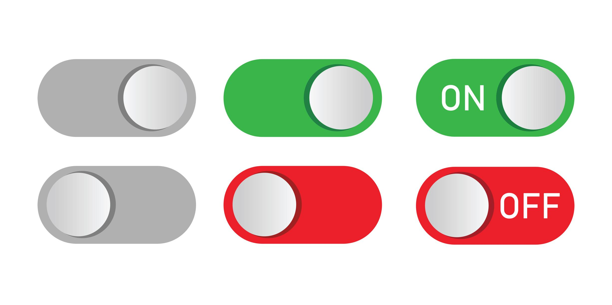

## Custom Switch Library (Android Kotlin)
[](https://kotlinlang.org/)
[](LICENSE)
[](#)

A **smooth, customizable, iOS-style toggle switch** for Android built with Kotlin.
Supports **drag gestures, bounce animation, haptic feedback**, and full customization via XML.

---

### Features

*  Smooth **bounce animation** (iOS-like)
*  Fully **customizable colors**
*  **Haptic feedback** on toggle
*  Smart state handling (`isChecked`)
*  Lightweight & easy to integrate
*  XML + Kotlin support

---

### Preview



---

## Installation (JitPack)

### 1️⃣ Add JitPack to your **root `settings.gradle` or `build.gradle`**

```gradle
dependencyResolutionManagement {
    repositories {
        google()
        mavenCentral()
        maven { url 'https://jitpack.io' }
    }
}
```
### Add Dependency
```
	dependencies {
	        implementation 'com.github.Excelsior-Technologies-Community:Android_CustomSwitch:1.0.0'
	}
```

---

### Usage

**XML Usage**

```xml
<com.ext.customswitch.CustomSwitchView
    android:layout_width="80dp"
    android:layout_height="40dp"
    app:activeColor="@android:color/holo_green_light"
    app:inactiveColor="@android:color/darker_gray"
    app:thumbColor="@android:color/white"
    app:isChecked="true"
    app:animationDuration="300"/>
```

---

**Kotlin Usage**

```kotlin
val switch = findViewById<CustomSwitchView>(R.id.customSwitch)

switch.setOnCheckedChangeListener { isChecked ->
    Toast.makeText(this, "State: $isChecked", Toast.LENGTH_SHORT).show()
}

// Set state manually
switch.setChecked(true)

// Get current state
val state = switch.isChecked()
```

---

### Customization Attributes

| Attribute           | Type    | Description              |
| ------------------- | ------- | ------------------------ |
| `activeColor`       | color   | Color when switch is ON  |
| `inactiveColor`     | color   | Color when switch is OFF |
| `thumbColor`        | color   | Thumb (circle) color     |
| `isChecked`         | boolean | Default state            |
| `animationDuration` | integer | Animation duration in ms |

---

### Public API

```kotlin
switch.setOnCheckedChangeListener { }

switch.setChecked(true)

val isOn = switch.isChecked()
```

---

### License

```
MIT License

Copyright (c) 2025 Excelsior Technologies 

Permission is hereby granted, free of charge, to any person obtaining a copy
of this software and associated documentation files (the "Software"), to deal
in the Software without restriction, including without limitation the rights
to use, copy, modify, merge, publish, distribute, sublicense, and/or sell
copies of the Software, and to permit persons to whom the Software is
furnished to do so, subject to the following conditions:

The above copyright notice and this permission notice shall be included in all
copies or substantial portions of the Software.

THE SOFTWARE IS PROVIDED "AS IS", WITHOUT WARRANTY OF ANY KIND, EXPRESS OR
IMPLIED, INCLUDING BUT NOT LIMITED TO THE WARRANTIES OF MERCHANTABILITY,
FITNESS FOR A PARTICULAR PURPOSE AND NONINFRINGEMENT. IN NO EVENT SHALL THE
AUTHORS OR COPYRIGHT HOLDERS BE LIABLE FOR ANY CLAIM, DAMAGES OR OTHER
LIABILITY, WHETHER IN AN ACTION OF CONTRACT, TORT OR OTHERWISE, ARISING FROM,
OUT OF OR IN CONNECTION WITH THE SOFTWARE OR THE USE OR OTHER DEALINGS IN THE
SOFTWARE.
```
